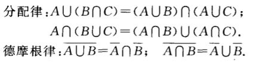

# 基本概念

**随机试验**： 满足以下3点，则称为随机事件， 记为 $E$

1. 可以在相同的条件下重复进行
1. 每次实验结果不止一个，并且事先知道所有的可能结果
1. 进行一次实验之前不能确定哪一个结果会出现

**样本空间**：**随机试验**E的所有结果的集合，称为**样本空间**，记为$S$

**样本点**：样本空间的元素，既每个结果。

**随机事件**： 满足某一条件的样本空间的子集。 比如E=丢色子实验观察点数，样本空间=[x|x $\in$ {1,2,3,4,5,6}], 定义一个时间A_1=[$x$|$x>3$], 那么 A_1=[x|x $\in$ {4,5,6}]。

**事件发生**: 指的是进行一次实验，其结果是否在事件的集合中，比如说丢色子结果是1， 那么 1 不在集合 A_1中，那么事件不发生，如果丢色子结果4，那么说事件发生

**两个特殊事件**: 如果 $A=S$, 那么A成为必然事件，如$A=\empty$,那么把A称为不可能事件

## 事件的运算

事件是一个集合，所以事件可以用集合的运算符来计算

### 假设实验E的样本空间为$S$,而$A，B，A_k(k=1,2,3...)$ 是$S$的子集

1. 若 A $\subseteq B$, 则称B包含A,说明事件A发生待变事件B一点发生
2. 若 A $\subseteq B$, 且，  B $\subseteq$A, 则称 $A=B$
3. 和事件 C=[x| x $\in$ A or x $\in$ B], 记为 C=A+B
4. 积事件 C=[x| x $\in$ A and x $\in$ B]记为 C=AB
5. 差事件 C = [x| x $\in$ A and x not $\in$ B ],记为 C=A-B
6. 互斥事件: 两个事件的积事件是空集
7. 对立事件：两个事件的积事件是空集 而且 他们的和事件是 样本空间

运算规律：交换律，结合律，分配律

德摩根律

